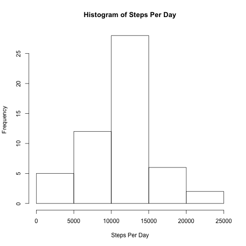
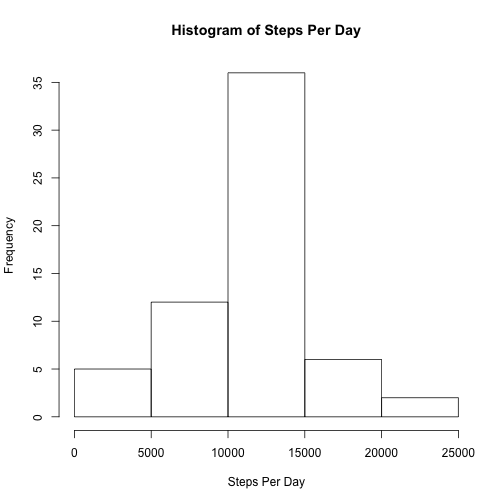

# Reproduceable Research - Peer Assessment 1
output: 
  html_document:
    keep_md: true
    
### Read CSV File

```r
    raw_data <- read.csv("activity.csv")
```

### Plot histogram of the total steps taken each day

```r
    steps_day <- aggregate(steps ~ date, data = raw_data, sum, na.rm=TRUE)
    hist(steps_day$steps, main="Histogram of Steps Per Day", 
         xlab="Steps Per Day")
```

 

### Calculate the mean and median of the total steps taken per day

```r
    mean(steps_day$steps)
```

```
## [1] 10766.19
```

```r
    median(steps_day$steps)
```

```
## [1] 10765
```

### Plot daily activity pattern

```r
    steps_int <- aggregate(steps ~ interval, data = raw_data, 
            mean, na.rm=TRUE)
    plot(steps ~ interval, data=steps_int, type="l")
```

 

### Which 5-minute interval contains the maximum number of steps?

```r
    steps_int[which.max(steps_int$steps),]$interval  
```

```
## [1] 835
```

### Calculate the total number of missing values in the dataset

```r
    sum(is.na(raw_data))
```

```
## [1] 2304
```

### Fill in all missing values and store
- Strategy for NA replacement: use the mean of the same interval

```r
    int_steps <- function(interval) {
    steps_int[steps_int$interval == interval, ]$steps
    }

    comp_data <- raw_data
    for(i in 1:nrow(raw_data)){
            if (is.na(raw_data[i,1])) {
                comp_data[i,]$steps <- int_steps(raw_data[i,]$interval)
            } else {
                comp_data[i,1] <- raw_data[i,1]
            }
        }
```

### Make a histogram of the total number of steps taken each day


```r
    comp_steps_data <- aggregate(steps ~ date, data = comp_data, sum, na.rm=TRUE)
    hist(comp_steps_data$steps, main="Histogram of Steps Per Day", 
         xlab="Steps Per Day")
```

 

## Calculate and report the mean and median total number of steps taken per day

```r
    mean(comp_steps_data$steps)
```

```
## [1] 10766.19
```

```r
    median(comp_steps_data$steps)
```

```
## [1] 10766.19
```
- There is very little difference between the mean/median before and after the NA's were replaced.  This is because they were replaced with the mean of the 5 minute interval

## Are there differences in activity patterns between weekdays and weekends?

```r
    library(lattice)
    WeekDays <- c("Monday","Tuesday","Wednesday","Thursday","Friday")
    for(i in 1:nrow(comp_data)){
        comp_data$days[i] <- weekdays(as.Date(comp_data$date[i],"%Y-%m-%d"))
        if (comp_data$days[i] %in% WeekDays) {
                comp_data$fac[i] <- "weekday"
            } else {
                comp_data$fac[i] <- "weekend"
            }
        }
    comp_data$fac <- factor(comp_data$fac, levels = c("weekday","weekend"))
    plot_data <- aggregate( steps ~ interval + fac, comp_data, mean)
    xyplot(steps ~ interval | fac, plot_data,layout=c(1,2), type="l")
```

 
